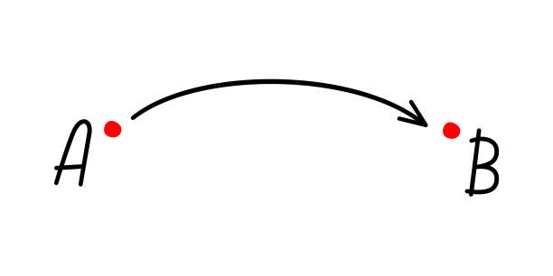

# Tinkerkit Braccio Robot V2

## Context and Origin

The goal of this project is to control a Tinkerkit Braccio Robot using C++ and Python languages.

## Objective
- Lift a small object from point A to point B.
- Control the Tinkerkit Braccio Robot with a Python-based graphical user interface

## Necessary Components (images)
-  
 
 
 
 
*See the **Project Purchase Links** section for purchase link(s)*

## Conclusion
TThis project allows for controlling the Tinkerkit Braccio Robot with a Python-based graphical user interface

*Representation of the project assembly*

# Version of Functional Files for this Project
- /Codes/.ino ---> **Tinkerkit_Braccio_Robot_V2.ino**
- /Codes/.py ---> **Tinkerkit_Braccio_Robot_V2.py**

# Problem(s) Encountered
See /Problems_Encountered ---> Problems Encountered.txt

# Purchase Link(s)
See /Project Purchase Links ---> Project Purchase Links.txt

# Additional Information Links
- [Tinkerkit Braccio Robot](https://store.arduino.cc/products/tinkerkit-braccio-robot?srsltid=AfmBOoqnkSuAP4uafBt4dP9YwFOZH6RlXR6_QzMfqL2X-oti75tEAzgk)
- [How to assemble the Tinkerkit Braccio robot](https://www.youtube.com/watch?v=Lwb2ppat_bs)
- [OSH: Schematics (Schematics in .pdf)](https://content.arduino.cc/assets/Braccio-Shield-V1.pdf)
- [OSH: Schematics (CAD files) (**Direct download**)](https://content.arduino.cc/assets/braccio%20cad.zip)
